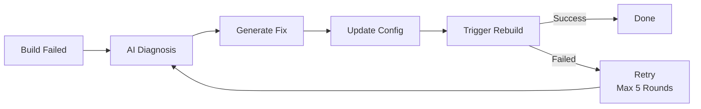

# DevOpsClaw

> **World's First pipecircle** - AI-powered CI/CD Self-Healing Pipeline
> 
> **Next-Generation CI/CD System**: Built on Highly Stable Jenkins + AI-Powered OpenClaw with New Quality Productive Forces

---

## Quick Start

### One-Click Deployment

```bash
cd DevOpsClaw
cp .env.example .env
chmod +x deploy_all.sh
sudo ./deploy_all.sh
```

Deployment Modes:
- **[1] Full Deployment + Nginx** (Production)
- **[4] Core Deployment** (Local Development, Recommended)

### Docker Compose

```bash
cp .env.example .env
docker compose up -d
```

---

## Port Allocation

| Service | Port | Description |
|---------|------|-------------|
| Jenkins | 8081 | Web UI |
| Jenkins Agent | 50000 | Master-Slave Communication |
| OpenClaw | 18789 | AI Platform |
| GitLab HTTP | 8082 | Web UI |
| GitLab SSH | 2222 | Git Operations |

---

## Architecture

```
┌─────────────────────────────────────────────────────┐
│                    Nginx (Reverse Proxy)              │
│         SSL Termination · Unified Logs · Port-based   │
│                        Forwarding                       │
└─────────────────────────────────────────────────────┘
                          │
                          ▼ HTTP
┌───────────┐ ┌───────────┐ ┌───────────┐
│  OpenClaw │ │  Jenkins  │ │  GitLab   │
│   (AI)    │ │   (CI)    │ │  (Repo)   │
└───────────┘ └───────────┘ └───────────┘
```

### Self-Healing Pipeline



---

## Common Commands

```bash
# Deploy
sudo ./deploy_all.sh

# Docker Compose
docker compose up -d
docker compose ps
docker compose logs -f
docker compose down

# Get Passwords
docker exec devopsclaw-jenkins cat /var/jenkins_home/secrets/initialAdminPassword
docker exec devopsclaw-gitlab cat /etc/gitlab/initial_root_password

# SSL Certificates
./deploy_nginx/generate_certs.sh
```

---

## FAQ

### Q: Docker Compose Installation Failed

**If using Docker Desktop (WSL Integration):**
1. Settings → Resources → WSL Integration
2. Enable your distribution
3. Restart WSL: `wsl --shutdown`

**Manual Installation:**
```bash
curl -fsSL https://download.docker.com/linux/ubuntu/gpg | sudo gpg --dearmor -o /etc/apt/keyrings/docker.gpg
echo "deb [arch=$(dpkg --print-architecture) signed-by=/etc/apt/keyrings/docker.gpg] https://download.docker.com/linux/ubuntu $(lsb_release -cs) stable" | sudo tee /etc/apt/sources.list.d/docker.list
sudo apt-get update && sudo apt-get install docker-compose-plugin
```

---

## Supported Environments

- ✅ WSL Ubuntu 22.04 / 24.04
- ✅ Native Ubuntu 22.04 / 24.04
- ✅ Docker / Docker Compose

---

## Documentation

- `doc/9deploy_ci_tool.md` - Complete Deployment Design (Chinese)
- `doc/3自愈式流水线.md` - Self-Healing Architecture (Chinese)
- `doc/5mvp_jenkins_rerun.md` - Version Iteration Notes (Chinese)

---

**中文版文档**: [README_zh.md](README_zh.md)

**Next Step**: Read `doc/9deploy_ci_tool.md` for detailed design.
