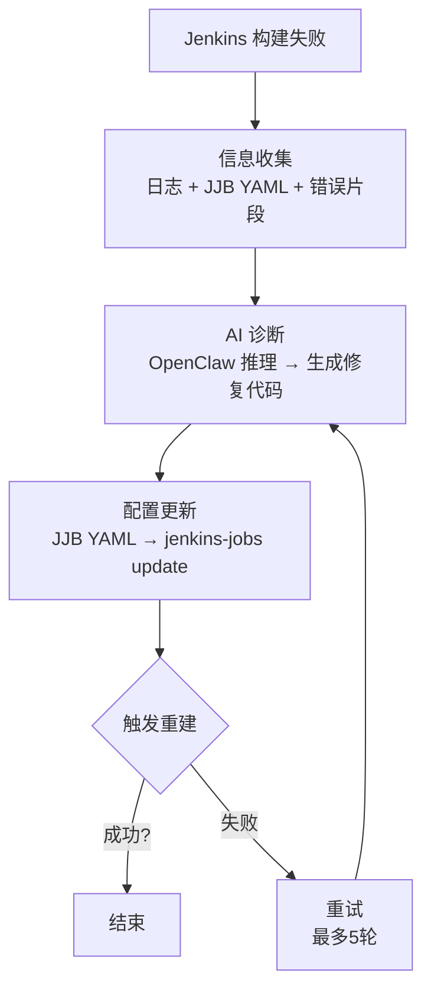

# DevOpsClaw

> **全球首创 pipecircle** - Jenkins pipeline → intelligent pipecircle.  
> OpenClaw-driven AI auto-diagnoses failures, patches your code, and git-pushes the fix, turning your CI/CD into a closed-loop repair machine.

---

## 目录

- [项目简介](#项目简介)
- [支持环境](#支持环境)
- [快速开始](#快速开始)
- [部署模式](#部署模式)
- [端口分配](#端口分配)
- [架构设计](#架构设计)
- [常见问题](#常见问题)
- [文档索引](#文档索引)

---

## 项目简介

DevOpsClaw 以传统高可用高稳定 Jenkins 和新质生产力 OpenClaw 为基石，提供：

| 特性 | 说明 |
|------|------|
| **一站式 CI 安装配置** | 一键部署 Jenkins、GitLab、OpenClaw、Nginx 反向代理 |
| **自愈式流水线** | 构建失败后 AI 自动诊断、生成修复代码、触发重建 |
| **极致提高 CI/CD 生产力** | 减少人工干预，实现闭环自动化 |
| **高度自治** | 完整的闭环架构，支持最多 5 轮重试 |

---

## 支持环境

- ✅ **WSL Ubuntu 22.04**
- ✅ **WSL Ubuntu 24.04**
- ✅ **原生 Ubuntu 22.04**
- ✅ **原生 Ubuntu 24.04**
- ✅ **Docker / Docker Compose**

---

## 快速开始

### 前提条件

确保你的系统已安装 **Docker**。如果使用 Docker Desktop for Windows，请确保：
1. 打开 Docker Desktop Settings
2. 进入 Resources → WSL Integration
3. 启用你的 WSL 发行版集成

### 一键部署

```bash
# 1. 进入项目目录
cd /path/to/DevOpsClaw

# 2. 复制环境变量模板
cp .env.example .env

# 3. 编辑配置（可选）
# vim .env

# 4. 运行部署脚本
chmod +x deploy_all.sh
sudo ./deploy_all.sh

# 5. 选择部署模式（参考下方说明）
```

### Docker Compose 方式（推荐）

```bash
# 1. 配置环境变量
cp .env.example .env

# 2. 启动所有服务
docker compose up -d

# 或单独启动某个服务
docker compose up -d jenkins
docker compose up -d gitlab
docker compose up -d nginx
```

---

## 部署模式

运行 `sudo ./deploy_all.sh` 后，会显示以下选项：

### 推荐模式

| 选项 | 模式 | 包含组件 | 适用场景 |
|------|------|----------|----------|
| **[1]** | 完整部署 + Nginx | OpenClaw + Jenkins + GitLab + Nginx | 生产环境推荐 |
| **[4]** | 核心部署（无 Nginx） | OpenClaw + Jenkins | 本地开发推荐 |

### 全部模式说明

```
[1] 完整部署 (Jenkins + OpenClaw + GitLab + Nginx)
    生产环境推荐，包含 Nginx 反向代理

[2] 核心部署 (Jenkins + OpenClaw + Nginx)
    不需要 GitLab 的生产环境

[3] 完整部署 (Jenkins + OpenClaw + GitLab，无 Nginx)
    本地开发，不需要 HTTPS

[4] 核心部署 (Jenkins + OpenClaw，无 Nginx) ⭐ 本地开发推荐
    最简部署，快速验证

[5] 仅 OpenClaw
    单独部署 AI 平台

[6] 仅 Jenkins
    单独部署 CI 服务器

[7] 仅 GitLab
    单独部署代码仓库

[8] 仅 Nginx 反向代理
    后端服务已存在，仅添加反向代理

[9] 配置集成 (使用已有服务)
    配置连接到外部 Jenkins/GitLab
```

---

## 端口分配

### 无 Nginx 模式（本地开发）

| 服务 | 端口 | 说明 |
|------|------|------|
| OpenClaw | 18789 | AI 平台 |
| Jenkins Web | 8081 | Jenkins UI |
| Jenkins Agent | 50000 | 主从通信 |
| GitLab HTTP | 8082 | GitLab UI |
| GitLab HTTPS | 8443 | GitLab HTTPS |
| GitLab SSH | 2222 | Git SSH 操作 |

> **注意**: 这些端口默认绑定 `127.0.0.1`，仅本地可访问。

### 带 Nginx 模式（生产环境）

#### Nginx 监听端口（HTTPS，外部可访问）

| 端口 | 转发到 | 说明 |
|------|--------|------|
| 443 | gitlab:80 | 默认 HTTPS |
| 8929 | gitlab:80 | GitLab |
| 8080 | jenkins:8080 | Jenkins |
| 18789 | openclaw:18789 | OpenClaw |

#### TCP 直连端口（不经过 Nginx）

| 端口 | 服务 | 说明 |
|------|------|------|
| 2222 | GitLab SSH | Git 命令行操作 |
| 50000 | Jenkins Agent | Jenkins 主从通信 |

---

## 架构设计

### v4.1.0 架构（带 Nginx 反向代理）

```
                    外部访问（HTTPS）
                          │
                          ▼
            ┌───────────────────────────┐
            │  Nginx (反向代理入口)      │
            │  · SSL 终结                │
            │  · 统一访问日志             │
            │  · 按端口转发              │
            └───────────────────────────┘
                          │
                          ▼ HTTP (内部网络)
            ┌───────────────────────────┐
            │  Docker 内部网络           │
            │                           │
            │  ┌─────────┐ ┌─────────┐ │
            │  │ OpenClaw│ │ Jenkins │ │
            │  │  (AI)   │ │  (CI)   │ │
            │  └─────────┘ └─────────┘ │
            │                           │
            │  ┌─────────┐              │
            │  │ GitLab  │              │
            │  │ (代码仓库)│              │
            │  └─────────┘              │
            └───────────────────────────┘
```

### 自愈闭环流程



---

## 常见问题

### Q1: Docker Compose 安装失败

**错误信息**: `E: Unable to locate package docker-compose-plugin`

**解决方案**:

如果你使用 **Docker Desktop for Windows**（WSL 集成）：
1. 打开 Docker Desktop Settings
2. 进入 Resources → WSL Integration
3. 启用你的 WSL 发行版集成
4. 重启 WSL: `wsl --shutdown`

如果使用原生 Docker：
```bash
# 添加 Docker 官方源
curl -fsSL https://download.docker.com/linux/ubuntu/gpg | sudo gpg --dearmor -o /etc/apt/keyrings/docker.gpg
echo "deb [arch=$(dpkg --print-architecture) signed-by=/etc/apt/keyrings/docker.gpg] https://download.docker.com/linux/ubuntu $(lsb_release -cs) stable" | sudo tee /etc/apt/sources.list.d/docker.list > /dev/null
sudo apt-get update
sudo apt-get install docker-compose-plugin
```

### Q2: 端口被占用

```bash
# 查看端口占用
sudo netstat -tlnp | grep -E ':(8080|8081|8082|2222|18789|50000)'

# 或使用 ss
sudo ss -tlnp | grep -E ':(8080|8081|8082|2222|18789|50000)'
```

修改 `.env` 文件中的端口配置，或停止占用进程。

### Q3: 获取 Jenkins 初始密码

```bash
# 方式 1: 从容器中获取
docker exec devopsclaw-jenkins cat /var/jenkins_home/secrets/initialAdminPassword

# 方式 2: 从数据卷获取
docker volume inspect devopsclaw_jenkins-home --format '{{.Mountpoint}}'
# 然后访问输出的路径下的 secrets/initialAdminPassword
```

### Q4: 获取 GitLab 初始密码

```bash
# 从容器中获取（24小时后自动删除）
docker exec devopsclaw-gitlab cat /etc/gitlab/initial_root_password
```

### Q5: 如何启用 Nginx 反向代理

```bash
# 1. 编辑 .env 文件
NGINX_ENABLED=true

# 2. 生成 SSL 证书（自签名）
./deploy_nginx/generate_certs.sh

# 3. 重新部署
sudo ./deploy_all.sh
# 选择 [1] 或 [2] 带 Nginx 的模式
```

### Q6: 服务启动缓慢

- **GitLab**: 首次启动需要 5-10 分钟
- **Jenkins**: 首次启动需要 2-3 分钟
- **Nginx**: 快速启动

查看日志：
```bash
# 查看所有服务日志
docker compose logs -f

# 查看特定服务
docker compose logs -f gitlab
docker compose logs -f jenkins
```

---

## 文档索引

### 核心文档

| 文档 | 说明 |
|------|------|
| `doc/9deploy_ci_tool.md` | 完整的部署设计文档，包含端口分配、架构设计 |
| `doc/3自愈式流水线.md` | 自愈式流水线架构说明 |
| `doc/11OpenClaw CI 自愈闭环流水线 — Skill 组合与实施方案.md` | OpenClaw Skill 组合实施方案 |
| `doc/5mvp_jenkins_rerun.md` | MVP 版本迭代说明 |

### 部署脚本

| 脚本 | 说明 |
|------|------|
| `deploy_all.sh` | 主部署脚本，支持多种部署模式 |
| `deploy_jenkins/deploy_jenkins.sh` | Jenkins 单独部署脚本 |
| `deploy_gitlab/deploy_gitlab.sh` | GitLab 单独部署脚本 |
| `deploy_nginx/deploy_nginx.sh` | Nginx 单独部署脚本 |
| `deploy_nginx/generate_certs.sh` | SSL 证书生成脚本 |

### 配置文件

| 文件 | 说明 |
|------|------|
| `docker-compose.yml` | Docker Compose 服务编排 |
| `.env.example` | 环境变量模板 |
| `deploy_nginx/nginx/` | Nginx 配置目录 |

---

## 命令速查

```bash
# ========== 部署相关 ==========
# 一键部署
sudo ./deploy_all.sh

# Docker Compose 方式
docker compose up -d              # 启动所有服务
docker compose up -d jenkins      # 启动指定服务
docker compose down               # 停止并删除
docker compose ps                 # 查看状态
docker compose logs -f            # 查看日志

# ========== 单独部署 ==========
sudo ./deploy_jenkins/deploy_jenkins.sh
sudo ./deploy_gitlab/deploy_gitlab.sh
sudo ./deploy_nginx/deploy_nginx.sh

# ========== 证书相关 ==========
./deploy_nginx/generate_certs.sh

# ========== 密码获取 ==========
# Jenkins 初始密码
docker exec devopsclaw-jenkins cat /var/jenkins_home/secrets/initialAdminPassword

# GitLab 初始密码
docker exec devopsclaw-gitlab cat /etc/gitlab/initial_root_password
```

---

## 版本历史

| 版本 | 日期 | 变更 |
|------|------|------|
| v4.1.0 | 2026-05-06 | 新增 Nginx 反向代理支持，完善 Docker Compose 安装逻辑 |
| v4.0.0 | 2026-05-06 | 架构简化，移除 PostgreSQL/Redis 独立容器，整合为 Skill 架构 |

---

## 许可证

本项目仅供学习和研究使用。

---

> **下一步**: 阅读 `doc/9deploy_ci_tool.md` 了解完整的部署设计文档。
