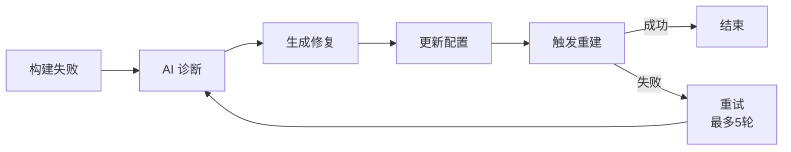

# DevOpsClaw

> **全球首创 pipecircle** - AI 驱动的 CI/CD 闭环修复系统

---

## 快速开始

### 一键部署

```bash
cd DevOpsClaw
cp .env.example .env
chmod +x deploy_all.sh
sudo ./deploy_all.sh
```

选择部署模式：
- **[1] 完整部署 + Nginx**（生产环境）
- **[4] 核心部署**（本地开发，推荐）

### Docker Compose 方式

```bash
cp .env.example .env
docker compose up -d
```

---

## 端口分配

| 服务 | 端口 | 说明 |
|------|------|------|
| Jenkins | 8081 | Web UI |
| Jenkins Agent | 50000 | 主从通信 |
| OpenClaw | 18789 | AI 平台 |
| GitLab HTTP | 8082 | Web UI |
| GitLab SSH | 2222 | Git 操作 |

---

## 架构

```
┌─────────────────────────────────────────────────────┐
│                     Nginx (反向代理)                  │
│              SSL 终结 · 统一日志 · 按端口转发          │
└─────────────────────────────────────────────────────┘
                          │
                          ▼ HTTP
┌───────────┐ ┌───────────┐ ┌───────────┐
│  OpenClaw │ │  Jenkins  │ │  GitLab   │
│   (AI)    │ │   (CI)    │ │ (代码仓库) │
└───────────┘ └───────────┘ └───────────┘
```

### 自愈闭环



---

## 常用命令

```bash
# 部署
sudo ./deploy_all.sh

# Docker Compose
docker compose up -d
docker compose ps
docker compose logs -f
docker compose down

# 密码获取
docker exec devopsclaw-jenkins cat /var/jenkins_home/secrets/initialAdminPassword
docker exec devopsclaw-gitlab cat /etc/gitlab/initial_root_password

# SSL 证书
./deploy_nginx/generate_certs.sh
```

---

## 常见问题

### Q: Docker Compose 安装失败

**如果使用 Docker Desktop（WSL 集成）：**
1. Settings → Resources → WSL Integration
2. 启用你的发行版
3. 重启 WSL: `wsl --shutdown`

**手动安装：**
```bash
curl -fsSL https://download.docker.com/linux/ubuntu/gpg | sudo gpg --dearmor -o /etc/apt/keyrings/docker.gpg
echo "deb [arch=$(dpkg --print-architecture) signed-by=/etc/apt/keyrings/docker.gpg] https://download.docker.com/linux/ubuntu $(lsb_release -cs) stable" | sudo tee /etc/apt/sources.list.d/docker.list
sudo apt-get update && sudo apt-get install docker-compose-plugin
```

---

## 支持环境

- ✅ WSL Ubuntu 22.04 / 24.04
- ✅ 原生 Ubuntu 22.04 / 24.04
- ✅ Docker / Docker Compose

---

## 文档

- `doc/9deploy_ci_tool.md` - 完整部署设计
- `doc/3自愈式流水线.md` - 自愈架构说明
- `doc/5mvp_jenkins_rerun.md` - 版本迭代说明

---

**下一步**: 阅读 `doc/9deploy_ci_tool.md` 了解详细设计。
