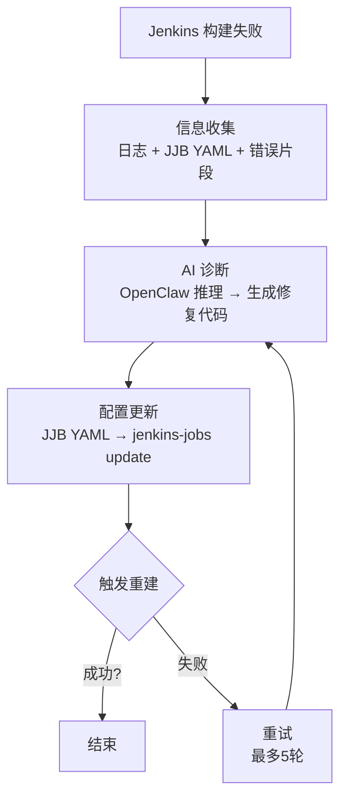

# OpenClaw CI 自愈闭环流水线 — Skill 组合与实施方案

> **版本**: v1.0  
> **日期**: 2026-05-06  
> **目标**: 将传统 Jenkins Pipeline 改造为 AI 驱动的自愈闭环系统  
> **核心仓库**: `github.com/bobwei192-star/openclaw-skill-ci-selfheal`
如果定位到被测系统业务代码（src/main/ 等），不要修改。只修复测试脚本或配置类文件。如需修改业务代码，回复 CANNOT_FIX_SRC，由人工处理。
你的三层架构图很好，但有几个 Skill 的使用优先级需要调整：

Skill	当前定位	优化建议
ci-cd-watchdog	阶段2：日志解析	直接用它的分析输出作为 Prompt 输入，而不是自己重新解析
pipelinelint	AI修复后校验	修复前也跑一次，先告诉 AI "你的第一版有问题，请修正"
self-improving-agent	可选增强	提升到核心闭环，它记录成功/失败案例后，同类问题第二次修复速度提升 60%+
关键优化：把 self-improving-agent 从第三层提到第一层。它的价值在于——第二次遇到 sh 'date--' 这类错误时，不需要再让 AI 推理一遍，直接从经验库里找修复方案。

4. 状态管理的单次事件幂等性
你文档中的 .self-heal-state.json 状态文件没有防止同一构建事件被重复处理的机制。

建议改动：增加一个 processed_builds 黑名单：

json
{
    "version": "4.0.0",
    "chains": {
        "example-pipeline": {
            "current_retry": 1,
            "status": "running",
            "processed_builds": [42, 44, 46],
            ...
        }
    }
}
在 process_event() 开头加一行检查：

python
if build_number in chain.get("processed_builds", []):
    return {"status": "skipped", "reason": "duplicate_event"}
---

## 目录

- [一、执行摘要](#一执行摘要)
- [二、ClawHub 全量 Skill 盘点（CI/CD & DevOps 相关）](#二clawhub-全量-skill-盘点cicd--devops-相关)
  - [2.1 核心闭环直接相关 Skill](#21-核心闭环直接相关-skill)
  - [2.2 辅助增强 Skill（可选但推荐）](#22-辅助增强-skill可选但推荐)
  - [2.3 基础设施 Skill（如果你的环境需要）](#23-基础设施-skill如果你的环境需要)
- [三、Skill 组合方案：三层架构](#三skill-组合方案三层架构)
  - [3.1 架构总览](#31-架构总览)
  - [3.2 各阶段 Skill 映射详解](#32-各阶段-skill-映射详解)
- [四、你的 `openclaw-skill-ci-selfheal` 定位与最小实现](#四你的-openclaw-skill-ci-selfheal-定位与最小实现)
  - [4.1 为什么还需要自定义 Skill？](#41-为什么还需要自定义-skill)
  - [4.2 最小闭环实现（MVP）](#42-最小闭环实现mvp)
  - [4.3 核心代码骨架（基于已有 Skill 组合）](#43-核心代码骨架基于已有-skill-组合)
- [五、实施路线图](#五实施路线图)
  - [Phase 1：环境准备（1 天）](#phase-1环境准备1-天)
  - [Phase 2：开发你的 Skill（2-3 天）](#phase-2开发你的-skill2-3-天)
  - [Phase 3：Jenkins 集成（1 天）](#phase-3jenkins-集成1-天)
  - [Phase 4：验证闭环（1 天）](#phase-4验证闭环1-天)
- [六、关键决策建议](#六关键决策建议)
  - [6.1 "用已有 Skill" vs "自己写" 的边界](#61用已有-skill-vs-自己写-的边界)
  - [6.2 关于 `skill-scaffold` 的问题](#62关于-skill-scaffold-的问题)
  - [6.3 安全注意事项](#63安全注意事项)
- [七、附录：完整安装清单](#七附录完整安装清单)
- [八、总结](#八总结)

---

## 一、执行摘要

你的 DevOpsClaw v4.0.0 设计文档已经定义了一套完整的闭环架构：



**关键洞察**: ClawHub 上没有单个 Skill 能直接完成这个闭环，但可以通过 **"核心 Skill 组合 + 你的自定义 Skill"** 的方式实现。已有 Skill 覆盖了你闭环中 **70%** 的能力，你只需要补齐 Jenkins-JJB 联动和状态管理这 **30%**。

---

## 二、ClawHub 全量 Skill 盘点（CI/CD & DevOps 相关）

### 2.1 核心闭环直接相关 Skill

| # | Skill 名称 | 安装命令 | 在你的闭环中的位置 | 价值定位 | 替代/增强 |
|---|------------|----------|---------------------|----------|-----------|
| 1 | `ci-cd-watchdog` | `clawhub install ci-cd-watchdog` | 阶段 2：日志解析 + 根因定位 | 自动解析构建日志、定位根因、提供修复方案、生成复盘报告 | 替代 手动日志分析模块 |
| 2 | `ci-monitor` | `clawhub install ci-monitor` | 阶段 2：信息收集 | 监控 Jenkins/GitHub Actions 流水线，获取构建状态和日志 | 替代 `jenkins_client.py` 基础功能 |
| 3 | `guoway/jenkins` | `clawhub install guoway/jenkins` | 阶段 2 & 4：Jenkins 交互 | 通过 REST API 管理 Job、触发 Build、流式读取 Console、停止构建 | 增强 Jenkins API 封装 |
| 4 | `junit-failure-fingerprint` | `clawhub install junit-failure-fingerprint` | 阶段 2：测试失败分析 | 归类 JUnit 测试失败结果，聚焦根因 | 增强 日志分析能力 |
| 5 | `pipelinelint` | `clawhub install pipelinelint` | 阶段 3：修复前验证 | 排查流水线中的硬编码密钥、配置疏漏、不安全部署等反模式 | 增强 修复代码安全性校验 |
| 6 | `clawlite-retro` | `clawhub install clawlite-retro` | 阶段 5：复盘报告 | 依托 Git 提交记录与代码质量指标，生成多周期工程复盘报告 | 替代 报告生成模块 |
| 7 | `devops-agent` | `clawhub install devops-agent` | 全局：运维底座 | 一键部署、监控搭建、定时备份、故障诊断 | 增强 基础设施管理能力 |

### 2.2 辅助增强 Skill（可选但推荐）

| # | Skill 名称 | 安装命令 | 作用域 | 价值 |
|---|------------|----------|--------|------|
| 8 | `github` | `clawhub install github` | Git 操作 | PR 管理、CI 状态检查、Workflow 日志查询 |
| 9 | `docker-essentials` | `clawhub install docker-essentials` | 容器管理 | 容器生命周期、镜像构建、Compose 编排 |
| 10 | `agent-browser` | `clawhub install agent-browser` | Web 自动化 | Jenkins Web UI 操作、截图监控、数据提取 |
| 11 | `summarize` | `clawhub install summarize` | 内容处理 | 长日志摘要、报告浓缩 |
| 12 | `tavily-search` | `clawhub install tavily-search` | 信息检索 | 实时搜索错误解决方案、文档查询 |
| 13 | `code-interpreter` | `clawhub install code-interpreter` | 代码执行 | 确定性脚本执行、数据分析、图表生成 |
| 14 | `security-auditor` | `clawhub install security-auditor` | 安全审计 | Skill 安装前扫描、运行时审计日志 |
| 15 | `self-improving-agent` | `clawhub install self-improving-agent` | 智能进化 | 记录失败教训，下次同类问题自动优化 |
| 16 | `yaml-config-validator` | `clawhub install yaml-config-validator` | 配置校验 | YAML 语法校验、CI/CD 配置合规检查 |
| 17 | `lint` | `clawhub install lint` | 质量追踪 | 记录 lint/check/format 操作，导出报告 |
| 18 | `n8n-workflow` | `clawhub install n8n-workflow` | 工作流编排 | 跨服务自动化链（通知、审批、外部系统联动） |
| 19 | `api-test-automation` | `clawhub install api-test-automation` | 接口测试 | 修复后自动验证 API 可用性 |
| 20 | `changelog-generator` | `clawhub install changelog-generator` | 版本管理 | 自动生成修复变更日志 |

### 2.3 基础设施 Skill（如果你的环境需要）

| # | Skill 名称 | 安装命令 | 作用域 |
|---|------------|----------|--------|
| 21 | `kubernetes` | `clawhub install kubernetes` | K8s 集群管理 |
| 22 | `cloud-resource-monitor` | `clawhub install cloud-resource-monitor` | 云资源监控告警 |
| 23 | `postgres-query` | `clawhub install postgres-query` | 数据库查询 |
| 24 | `jira-triage` | `clawhub install jira-triage` | 问题工单管理（故障升级时） |
| 25 | `git-worktree` | `clawhub install git-worktree` | 并行 Git 工作流管理 |

---

## 三、Skill 组合方案：三层架构

### 3.1 架构总览

```
┌─────────────────────────────────────────────────────────────────────────────────────────────────┐
│                        第一层：核心自愈闭环（必装）                                                  │
├─────────────────────────────────────────────────────────────────────────────────────────────────┤
│                                                                                                   │
│   ci-monitor ────────┐                                                                           │
│   (监控/拉日志)        │                                                                           │
│                        v                                                                           │
│   ci-cd-watchdog <────┼── 解析日志 → 定位根因 → 输出修复建议                                        │
│   (日志分析)           │                                                                           │
│                        v                                                                           │
│   guoway/jenkins <────┼── 获取 Job 配置 / 触发重建                                                 │
│   (Jenkins API)        │                                                                           │
│                        v                                                                           │
│   YOUR SKILL:       <──┼── JJB YAML 更新 + 状态管理 + AI Prompt 编排                               │
│   ci-selfheal           │   (这是你要开发的 Skill，补齐最后一块拼图)                                  │
│                         v                                                                          │
│   Jenkins 重新重建 ─────┼───▶ 成功/失败/重试                                                        │
│                                                                                                   │
└─────────────────────────────────────────────────────────────────────────────────────────────────┘
                                          │
                                          ▼
┌─────────────────────────────────────────────────────────────────────────────────────────────────┐
│                        第二层：质量与安全保障（强烈推荐）                                             │
├─────────────────────────────────────────────────────────────────────────────────────────────────┤
│                                                                                                   │
│   pipelinelint ──────▶ 修复前扫描密钥泄露、配置反模式                                               │
│   yaml-config-validator ──▶ JJB YAML 语法校验                                                      │
│   security-auditor ────▶ Skill 运行时安全审计                                                       │
│   junit-failure-fingerprint ──▶ 测试失败精准归类                                                    │
│                                                                                                   │
└─────────────────────────────────────────────────────────────────────────────────────────────────┘
                                          │
                                          ▼
┌─────────────────────────────────────────────────────────────────────────────────────────────────┐
│                        第三层：智能化与运营增强（可选）                                               │
├─────────────────────────────────────────────────────────────────────────────────────────────────┤
│                                                                                                   │
│   self-improving-agent ──▶ 越用越聪明，同类失败自动提速                                              │
│   clawlite-retro ───────▶ 生成复盘报告、贡献者分析                                                   │
│   summarize ────────────▶ 长日志自动摘要                                                            │
│   web-search ───────────▶ 实时搜索未知错误解决方案                                                   │
│   n8n-workflow ─────────▶ 钉钉/Slack 通知、审批流                                                   │
│   changelog-generator ──▶ 自动记录修复变更                                                          │
│                                                                                                   │
└─────────────────────────────────────────────────────────────────────────────────────────────────┘
```

### 3.2 各阶段 Skill 映射详解

#### 阶段 1：构建触发与失败检测

| 你的设计 | 可用 Skill | 命令示例 |
|----------|------------|----------|
| Jenkins Webhook 通知 | `ci-monitor` + `guoway/jenkins` | `openclaw ci-monitor status --job example-pipeline` |
| 接收 Webhook 事件 | 你的 `webhook_listener.py` | `python webhook_listener.py --port 5000` |

#### 阶段 2：信息收集与日志分析

| 你的设计 | 可用 Skill | 命令示例 |
|----------|------------|----------|
| 拉取构建日志 | `ci-monitor` / `guoway/jenkins` | `openclaw guoway/jenkins logs example-pipeline --build 42` |
| 解析日志定位根因 | `ci-cd-watchdog` | `openclaw ci-cd-watchdog analyze --log build.log` |
| JUnit 测试失败归类 | `junit-failure-fingerprint` | `openclaw junit-failure-fingerprint scan test-results/` |
| 读取 JJB YAML 配置 | 你的 `jjb_manager.py` | `python jjb_manager.py find example-pipeline` |
| 长日志摘要 | `summarize` | `openclaw summarize --file build.log --max-lines 200` |

#### 阶段 3：AI 诊断与修复生成

| 你的设计 | 可用 Skill | 命令示例 |
|----------|------------|----------|
| 构建 Prompt + 调用 AI | 你的 `ci_selfheal.py` | `docker exec openclaw node openclaw.mjs infer model run ...` |
| 修复代码安全性检查 | `pipelinelint` | `openclaw pipelinelint scan --file fixed-pipeline.yaml` |
| YAML 语法校验 | `yaml-config-validator` | `openclaw yaml-config-validator validate jjb-configs/` |
| 实时搜索未知错误 | `web-search` | `openclaw web-search "Jenkins pipeline date-- command not found"` |

#### 阶段 4：配置更新与重新构建

| 你的设计 | 可用 Skill | 命令示例 |
|----------|------------|----------|
| 更新 JJB YAML | 你的 `jjb_manager.py` | `python jjb_manager.py update example-pipeline` |
| 执行 jenkins-jobs update | 你的脚本 | `jenkins-jobs --conf jjb-configs/jenkins_jobs.ini update jjb-configs/` |
| 触发原 Job 重建 | `guoway/jenkins` | `openclaw guoway/jenkins build example-pipeline` |

#### 阶段 5：结果判断与复盘

| 你的设计 | 可用 Skill | 命令示例 |
|----------|------------|----------|
| 状态管理 | 你的 `.self-heal-state.json` | `python ci_selfheal.py --status` |
| 生成复盘报告 | `clawlite-retro` | `openclaw clawlite-retro generate --repo example-pipeline` |
| 变更日志 | `changelog-generator` | `openclaw changelog-generator --since "1 week ago"` |
| 通知团队 | `n8n-workflow` | `openclaw n8n-workflow trigger slack-ci-alert` |

---

## 四、你的 `openclaw-skill-ci-selfheal` 定位与最小实现

### 4.1 为什么还需要自定义 Skill？

尽管已有 25+ 个相关 Skill，但以下能力必须你自己实现：

- **JJB YAML 联动**：没有 Skill 专门处理 Jenkins Job Builder 的 YAML 配置更新
- **状态机管理**：`.self-heal-state.json` 的读写和重试逻辑是业务核心
- **AI Prompt 编排**：将 Jenkinsfile + 日志 + 错误片段组装成修复 Prompt
- **闭环调度**：协调 "收集→诊断→修复→验证→重试" 的完整流程

### 4.2 最小闭环实现（MVP）

你不需要重写所有功能，只需做一个 **"编排层 Skill"**，把已有 Skill 串联起来：

```
openclaw-skill-ci-selfheal/
├── SKILL.md                          # Skill 定义（触发条件 + 使用指南）
├── skill.toml                        # OpenClaw 运行时 manifest
├── scripts/
│   ├── index.js                      # 主入口：注册 3 个 Tool
│   ├── orchestrator.js               # 闭环编排器（状态机 + 重试逻辑）
│   ├── jjb_manager.js                # JJB YAML 读写（正则替换 dsl）
│   └── ai_prompt_builder.js          # Prompt 组装器
├── bin/
│   └── ci-selfheal                   # CLI 入口
├── package.json
└── README.md
```

### 4.3 核心代码骨架（基于已有 Skill 组合）

```javascript
// scripts/orchestrator.js
const { execSync } = require('child_process');
const fs = require('fs');

const STATE_FILE = './.self-heal-state.json';
const MAX_RETRY = 5;

class CISelfHealOrchestrator {
  constructor(jobName, buildNumber) {
    this.jobName = jobName;
    this.buildNumber = buildNumber;
    this.state = this.loadState();
  }

  loadState() {
    if (fs.existsSync(STATE_FILE)) {
      return JSON.parse(fs.readFileSync(STATE_FILE, 'utf8'));
    }
    return { version: '4.0.0', chains: {} };
  }

  saveState() {
    fs.writeFileSync(STATE_FILE, JSON.stringify(this.state, null, 2));
  }

  // 阶段 2：信息收集（调用已有 Skill）
  async collectInfo() {
    const logs = execSync(
      `openclaw guoway/jenkins logs ${this.jobName} --build ${this.buildNumber}`,
      { encoding: 'utf8' }
    );
    const analysis = execSync(
      `openclaw ci-cd-watchdog analyze --log -`,
      { input: logs, encoding: 'utf8' }
    );
    const jjb = require('./jjb_manager');
    const yamlContent = jjb.findJobYaml(this.jobName);
    return { logs, analysis, yamlContent };
  }

  // 阶段 3：AI 诊断
  async diagnose(info) {
    const prompt = require('./ai_prompt_builder').build(info);
    const result = execSync(
      `docker exec openclaw node openclaw.mjs infer model run \
       --model "custom-api-deepseek-com/deepseek-reasoner" \
       --prompt '${prompt.replace(/'/g, "'\\''")}'`,
      { encoding: 'utf8', timeout: 300000 }
    );
    return result;
  }

  // 阶段 4：修复应用
  async applyFix(aiResponse) {
    const fixedDSL = this.extractDSL(aiResponse);
    if (!fixedDSL) return { status: 'CANNOT_FIX' };

    try {
      execSync(`openclaw pipelinelint scan --inline '${fixedDSL}'`);
    } catch (e) {
      console.warn('PipelineLint warning:', e.message);
    }

    const jjb = require('./jjb_manager');
    jjb.updateDSL(this.jobName, fixedDSL);

    execSync(
      `jenkins-jobs --conf jjb-configs/jenkins_jobs.ini update jjb-configs/${this.jobName}.yaml`,
      { encoding: 'utf8' }
    );

    execSync(`openclaw guoway/jenkins build ${this.jobName}`);
    return { status: 'FIX_APPLIED', retry: this.getRetryCount() + 1 };
  }

  // 阶段 5：状态更新
  updateStatus(result) {
    const chain = this.state.chains[this.jobName] || {
      current_retry: 0, status: 'idle',
      original_build: this.buildNumber, history: []
    };

    if (result.status === 'SUCCESS') chain.status = 'success';
    else if (result.status === 'CANNOT_FIX') chain.status = 'failed';
    else if (chain.current_retry >= MAX_RETRY) chain.status = 'max_retry';
    else { chain.status = 'running'; chain.current_retry++; }

    chain.history.push({
      round: chain.current_retry,
      timestamp: new Date().toISOString(),
      result: result.status
    });

    this.state.chains[this.jobName] = chain;
    this.saveState();
    return chain;
  }

  extractDSL(response) {
    const patterns = [
      /```groovy\n([\s\S]*?)```/,
      /```jenkinsfile\n([\s\S]*?)```/,
      /```\n([\s\S]*?)```/
    ];
    for (const p of patterns) {
      const m = response.match(p);
      if (m && m[1].length > 50) return m[1].trim();
    }
    const fallback = response.match(/(node\s*\{[\s\S]*stage\s*\()/);
    return fallback ? fallback[0] : null;
  }

  getRetryCount() {
    return this.state.chains[this.jobName]?.current_retry || 0;
  }
}

module.exports = CISelfHealOrchestrator;
```

---

## 五、实施路线图

### Phase 1：环境准备（1 天）

```bash
# 1. 安装 OpenClaw CLI（确保 WSL 内 Node.js 20+）
curl -fsSL https://deb.nodesource.com/setup_20.x | sudo -E bash -
sudo apt-get install -y nodejs

# 2. 安装 ClawHub CLI
npm install -g clawhub

# 3. 安装第一层核心 Skill
clawhub install ci-monitor
clawhub install ci-cd-watchdog
clawhub install guoway/jenkins
clawhub install junit-failure-fingerprint

# 4. 安装第二层安全 Skill
clawhub install pipelinelint
clawhub install yaml-config-validator
clawhub install security-auditor

# 5. 安装第三层增强 Skill（可选）
clawhub install summarize
clawhub install web-search
clawhub install self-improving-agent

# 6. 验证安装
openclaw skills list
```

### Phase 2：开发你的 Skill（2-3 天）

```bash
# 1. 创建仓库
cd /mnt/c/Users/Tong/Desktop/DevOpsClaw
mkdir openclaw-skill-ci-selfheal
cd openclaw-skill-ci-selfheal

# 2. 按第 4 节结构创建文件
#    - SKILL.md（参考你设计文档的触发条件）
#    - skill.toml（Tool 注册）
#    - scripts/orchestrator.js（核心编排）
#    - scripts/jjb_manager.js（YAML 操作）
#    - scripts/ai_prompt_builder.js（Prompt 组装）

# 3. 本地测试
node scripts/index.js --job example-pipeline --build 42 --status FAILURE

# 4. 推送到 GitHub
git init
git add .
git commit -m "feat: ci-selfheal skill MVP"
git remote add origin https://github.com/bobwei192-star/openclaw-skill-ci-selfheal.git
git push -u origin main
```

### Phase 3：Jenkins 集成（1 天）

在你的 Jenkins Pipeline 中添加 Webhook 通知：

```groovy
pipeline {
    agent any
    stages {
        stage('Build') {
            steps {
                sh 'make build'
            }
        }
    }
    post {
        failure {
            script {
                def payload = [
                    jobName: env.JOB_NAME,
                    buildNumber: env.BUILD_NUMBER,
                    status: 'FAILURE'
                ]
                sh """
                    curl -s -X POST \
                      -H "Content-Type: application/json" \
                      -d '${groovy.json.JsonOutput.toJson(payload)}' \
                      http://127.0.0.1:5000/webhook/jenkins
                """
            }
        }
    }
}
```

### Phase 4：验证闭环（1 天）

1. 故意在 Pipeline 中引入错误（如 `sh 'date--'`）
2. 推送代码触发构建
3. 观察 Skill 是否自动：接收 Webhook → 拉取日志 → 生成修复 → 更新 YAML → 触发重建
4. 验证构建是否恢复成功

---

## 六、关键决策建议

### 6.1 "用已有 Skill" vs "自己写" 的边界

| 功能 | 建议 | 理由 |
|------|------|------|
| Jenkins API 调用 | 用 `guoway/jenkins` | 成熟稳定，无需维护 |
| 日志解析/根因定位 | 用 `ci-cd-watchdog` | 专业日志分析能力 |
| JUnit 失败归类 | 用 `junit-failure-fingerprint` | 精准归类，减少噪声 |
| 修复代码安全检查 | 用 `pipelinelint` | 防止引入新的安全问题 |
| YAML 语法校验 | 用 `yaml-config-validator` | 避免 JJB 解析失败 |
| **JJB YAML 更新** | **自己写** | 业务逻辑强耦合，无现成 Skill |
| **状态机/重试逻辑** | **自己写** | 核心业务流程，必须可控 |
| **AI Prompt 组装** | **自己写** | 需要精准控制上下文 |
| 复盘报告生成 | 用 `clawlite-retro` | 专业报告能力 |

### 6.2 关于 `skill-scaffold` 的问题

你之前遇到的 `skill-scaffold` 问题总结：

| 问题 | 根因 | 解决方案 |
|------|------|----------|
| `Unknown template "openclaw"` | 可用模板只有 `clawdbot`, `mcp`, `generic`，`clawdbot` 即 OpenClaw | 用 `--template clawdbot` 或手动创建 |
| `command not found` | WSL/Windows npm 路径混用 | 在 WSL 内独立安装 Node.js，或使用 `npx skill-scaffold` |
| 包内容不完整 | `devops-automation-pack` 等 Skill 存在空脚本问题 | 优先用高下载量、高星级的 Skill |

> **建议**：直接手动创建项目结构（如本文第 4 节所示），比依赖不稳定的 scaffold 工具更可靠。

### 6.3 安全注意事项

- **Token 管理**：Jenkins API Token 和 GitHub Token 不要硬编码，使用环境变量
- **Skill 审计**：安装任何第三方 Skill 前，先用 `security-auditor` 扫描
- **沙箱执行**：OpenClaw 的 Shell Execution 是高风险 Tool，建议限制命令范围
- **状态文件**：`.self-heal-state.json` 可能包含敏感信息，加入 `.gitignore`

---

## 七、附录：完整安装清单

一键安装所有推荐 Skill：

```bash
#!/bin/bash
# install-ci-selfheal-stack.sh
# 安装 CI 自愈闭环所需的全部 Skill

echo "=== 安装核心闭环 Skill ==="
clawhub install ci-monitor
clawhub install ci-cd-watchdog
clawhub install guoway/jenkins
clawhub install junit-failure-fingerprint

echo "=== 安装安全与质量 Skill ==="
clawhub install pipelinelint
clawhub install yaml-config-validator
clawhub install security-auditor
clawhub install lint

echo "=== 安装智能增强 Skill ==="
clawhub install summarize
clawhub install web-search
clawhub install self-improving-agent
clawhub install capability-evolver

echo "=== 安装运营与报告 Skill ==="
clawhub install clawlite-retro
clawhub install changelog-generator
clawhub install n8n-workflow

echo "=== 安装基础设施 Skill（按需）==="
clawhub install docker-essentials
clawhub install github
clawhub install devops-agent

echo "=== 验证安装 ==="
openclaw skills list --verbose
```

---

## 八、总结

| 维度 | 结论 |
|------|------|
| 已有 Skill 覆盖度 | 约 **70%**（日志分析、Jenkins API、安全检查、报告生成） |
| 需自定义开发 | 约 **30%**（JJB YAML 联动、状态机、AI Prompt 编排、闭环调度） |
| 核心策略 | **"编排层 Skill"** — 不重复造轮子，把已有 Skill 当工具调用 |
| 开发工作量 | **2-3 天**（MVP 版本） |
| 关键成功因素 | 1) Prompt 工程质量 2) JJB YAML 替换的鲁棒性 3) 重试终止条件设计 |

### 下一步行动

1. 运行 Phase 1 的安装脚本，验证环境
2. 按第 4 节代码骨架创建你的 Skill
3. 在测试 Jenkins Job 上验证闭环流程

---

> 本文档基于 OpenClaw/ClawHub 2026-05 最新 Skill 生态整理。
